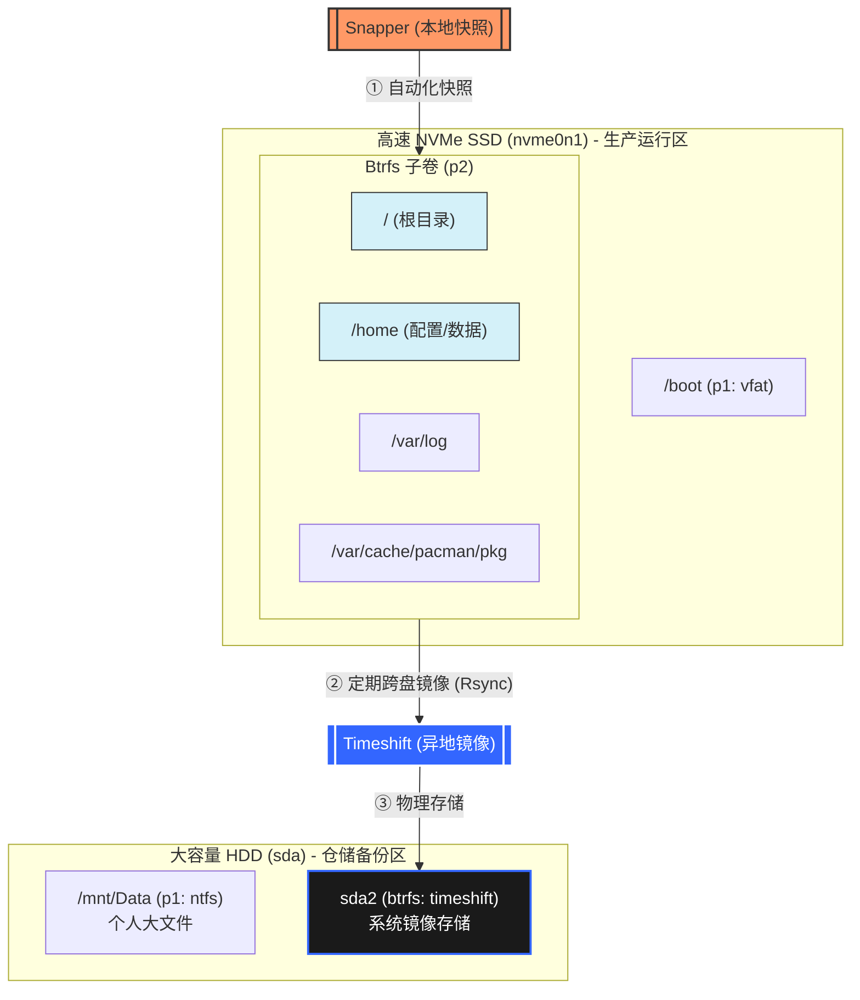

这篇文章主要记录我当前使用的 Arch Linux 环境配置，包括系统安装后的基础软件、桌面习惯、终端工具链，以及一些长期稳定使用的个性化设置。重点不是写成一篇通用安装教程，而是把我自己的配置思路和取舍说明白，方便以后重装系统时快速恢复，也方便对照迭代。

## 这篇文章记录什么

- 这不是 Arch Linux 入门安装教程，而是我的个人配置清单
- 目标读者是谁：未来的我，以及想参考配置思路的人
- 这篇文章重点回答什么问题：我现在的 Arch Linux 是怎么配出来的
- 阅读方式建议：按模块看，而不是从头机械照抄

## 我的使用场景和配置目标

- 这台机器主要拿来做什么
- 我更看重哪些点：稳定、轻量、可维护、开发效率
- 我不追求哪些东西：过度美化、过多后台服务、复杂依赖
- 这些目标如何影响后面的软件选择和配置方式

## 系统基础信息

- 当前使用的硬件和大致环境
- 系统版本、内核、引导方式
- 文件系统和分区思路
- 是否使用加密、交换分区、快照等功能
- 这里建议放一份最小化的系统概览

## 安装完成后的基础初始化

- pacman 镜像源和更新习惯
- 必装基础包
- sudo、网络、时间同步、字体、输入法等基础组件
- AUR 助手是否安装，以及为什么选择它
- 新系统装完后我第一时间会做哪些设置

## 桌面环境与外观配置

- 我使用的桌面环境或窗口管理器
- 显示管理器、主题、图标、字体配置
- 分辨率、缩放、多显示器相关设置
- 状态栏、通知、截图、剪贴板工具
- 外观上我保留了哪些最常用的习惯

## 终端与 Shell 工作流

- 默认 shell 是什么，为什么这样选
- prompt、别名、补全、历史记录配置
- 终端模拟器的选择
- 常用命令行工具清单
- 我平时最依赖的终端工作流有哪些

## 开发环境配置

- Git、SSH、GPG 或签名相关设置
- Node.js、Python、Rust、Go 等开发工具链如何管理
- 编辑器或 IDE 的选择与核心插件
- 语言环境、代理、包管理相关配置
- 我如何让开发环境在不同项目之间保持一致

## 常用软件清单

- 浏览器、文件管理器、播放器、笔记工具等日常软件
- 通讯、同步、下载、压缩、PDF 阅读等辅助软件
- 每类软件为什么选择它，而不是别的方案
- 哪些软件是必装，哪些只是可选

## 输入法、字体与中文环境

- 中文输入法方案
- 字体安装与 fallback 策略
- 终端和 GUI 环境下的中文显示问题
- 遇到乱码、候选框异常时怎么排查

## 电源、风扇与性能调优

- 笔记本或台式机的电源策略
- 风扇控制、温度监控、功耗管理
- CPU 调频、休眠、唤醒等设置
- 在安静、省电和性能之间如何取舍

## 文件、备份与同步策略

## 🛡️ Arch Linux 全维度备份方案清单

| 维度 | 核心工具 | 备份频率 | 解决的核心问题 |
| :--- | :--- | :--- | :--- |
| **系统级** | **Timeshift** (Rsync模式) 或 **Snapper** | 自动（系统更新前 / 每日） | 系统无法启动、内核崩溃、驱动挂了、分区表损坏 |
| **配置级** | **Git** + **Chezmoi** / **Stow** | 手动（每次修改并确认有效后 Push） | 桌面环境 (niri) 配置、终端美化、快捷键丢失、脚本误删 |
| **应用级** | **Pacman list** (脚本自动导出) | 每周一次（建议配合 Systemd Timer） | 重装系统后，通过清单一键找回所有已安装的软件 |
| **数据级** | **Rclone** / **阿里云盘** / **BaiduNetdisk** | 重要文件实时同步 / 每日定时 | 文档、代码、AI 模型权重 (LoRA) 等不可再生资源 |

我的核心思路是利用 `timeshift` 的直观容灾能力，利用 `snapper` 的自动化颗粒度实现系统的快速回滚。

这一部分比“装了哪些软件”更重要。软件清单丢了还可以慢慢补，配置和个人数据一旦散落在各处，重装系统时就会非常痛苦。我的思路是尽量把需要长期保留的东西分成三类：配置文件、工作数据、临时文件。前两类要有明确归档和恢复路径，最后一类则尽量少做备份。

### 配置文件怎么管理

我会优先把真正需要长期维护的配置收拢起来，而不是把整个 `home` 目录一股脑打包。像 shell、编辑器、Git、终端模拟器、窗口管理器这类配置，通常都值得单独整理。这样做的好处是结构清楚，迁移时也更容易判断哪些内容必须恢复，哪些内容可以重建。

如果配置已经越来越多，最好把它们纳入一套固定的管理方式。最常见的做法是维护一份 `dotfiles`，把常用配置统一收口。这样一来，系统重装之后不需要回忆“那个配置到底改过没有”，而是直接按已有清单恢复。

### 哪些内容值得备份

我会优先备份这些内容：

- 各类配置文件，例如 shell、编辑器、窗口管理器、输入法和 Git 配置
- 开发相关凭据和连接信息，例如 SSH 配置、已知主机记录，以及其他需要手动重建成本较高的内容
- 文档、笔记、脚本、项目模板这类长期积累的数据
- 浏览器书签、导出配置或其他不容易重新整理的个人资料

相对来说，下面这些东西通常不值得重点备份：

- 包管理器缓存
- 可以随时重新安装的软件本体
- 构建产物、下载缓存、临时目录
- 大量可再生成的数据

### 本地备份和云同步的分工

我不太把“同步”和“备份”混为一谈。同步的作用是让多台设备上的文件保持一致，方便日常使用；备份的作用是在误删、损坏、系统重装之后还能把东西找回来。这两者目标不同，所以最好分开看。

对我来说，本地备份更像兜底方案，重点是可恢复；云同步更像日常协作方案，重点是方便访问。真正重要的文件，最好同时具备这两层保障，而不是只依赖某一个同步目录。

### 重装系统时如何快速恢复

如果以后要重装系统，我希望恢复过程尽量固定，而不是临时想起来补什么。比较理想的顺序一般是：

1. 先恢复基础网络、包管理、输入法和终端环境。
2. 再拉回核心配置，例如 shell、编辑器、Git 和窗口管理器配置。
3. 然后恢复工作目录、脚本、笔记和常用资料。
4. 最后再补装非核心软件，并根据使用情况微调。

这样做的好处是，就算当天没把所有软件装齐，最基本的工作流也已经能先跑起来，不会因为缺少某个边缘软件就完全卡住。

### 我希望长期保持的原则

- 配置文件尽量集中管理，不要分散在太多难以回忆的位置
- 备份对象要有优先级，先保留难以重建的内容
- 同步服务解决的是“随时可用”，备份解决的是“出问题后还能恢复”
- 恢复流程要尽量标准化，最好下次重装时不用重新摸索一遍

## 我保留的一些自定义习惯

- 键位映射和快捷键
- 常用脚本和自动化命令
- 启动项和登录后自动执行任务
- 一些小但高频的体验优化

## 问题记录与排查经验

- 我实际遇到过哪些问题
- 每个问题的表现、原因和解决方式
- 哪些坑值得在重装前提前避开
- 哪些问题到现在还只是临时方案

## 后续维护方式

- 平时如何更新系统
- 如何降低滚动发行带来的风险
- 配置变更后我会怎么记录
- 什么时候值得重构自己的配置

## 总结

- 这套配置的核心思路是什么
- 目前最满意的部分和仍不满意的部分
- 未来还打算继续调整哪些方向
