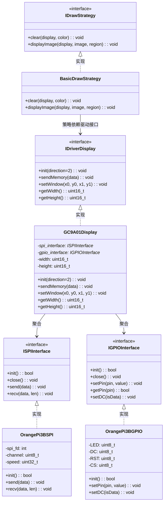

# 1. 硬件资源

开发板使用的是 RK3566 芯片的 Orangepi 3B，屏幕使用的是 1.28 寸 TFT 液晶屏 GC9A01。Orangepi 3B 引出的引脚资源可以使用 `gpio readall` 查看，


屏幕的原理图如下，总共引出了 8 个引脚。RST、LED、GND、VCC、SDA、DC、CS 和 SCL。


# 2. 接线

GC9A01 使用的是 SPI 协议进行通信的，所以注意 Orangepi 3B 要打开这个功能，这里不赘述怎么打开，具体可以看用户手册。打开成功后应该存在 `/dev/spidev3.0` 的设备节点。

| wPi| GPIO | gc9a01 |
| --- | ----------- | ------ |
| 8 | 130 | DC |
| 5 | 118 | RST |
| 10 | 129 | LED |
| 7 | 128 | CS |
| 11 | 138 | SDA |
| 12 | 136 | SCL |
| 3.3V | VCC |
| GND | GND |

:::important
这里一定要参考用户手册，用户手册中使用 gpio 命令操作引脚使用的是 wpi 编号而不是 gpio 号，wpi 编号就是 WiringPi 库提供的编号系统，由于本次使用的是 WiringPi 封装好的操作 gpio 的接口函数，所以请注意使用 wpi 编号。
:::

# 3. 驱动代码

::github{repo="Tz-slayer/rk3566_gc9a01"}

类结构图如下



# 4. 使用 rga 和 opencv 处理图像速度对比
```bash
(base) orangepi@orangepi3b:~/newbot/rk3566_gc9a01/tests/build$ ./test_rga
[OpenCV Color Conversion] Executed 10 times, Total time: 228.112 ms, Average time per run: 22.811 ms
rga_api version 1.9.3_[2]
[RGA Color Conversion] Executed 10 times, Total time: 118.516 ms, Average time per run: 11.852 ms
[OpenCV Resize] Executed 10 times, Total time: 234.194 ms, Average time per run: 23.419 ms
[RGA Resize] Executed 10 times, Total time: 190.921 ms, Average time per run: 19.092 ms
```

rga 的方法是我自定义的方法，由于我的开发板是 8g 内存，所以相较于 4g 内存需要提前申请 DMA 空间，这一步骤占据的时间开销比较大；所以本次测试 使用 opencv 进行处理的时候也将提前申请 DMA 空间的时间开销算上了。
